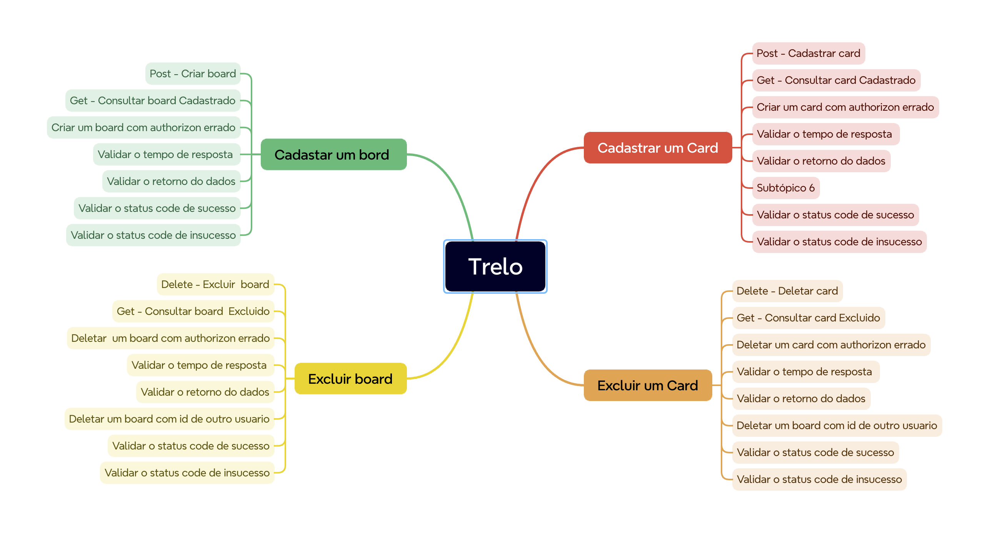

Testes automatizados  da API do Trello

Antes de rodar o testes  criar o arquivo cypress.env.json e passar os valores de key e token 
Segue um exemplo do arquivo cypress.env.json exemplo

Para rodar os teste existe duas formas 
npm run test  - rodas os teste via clie 
npm run cy:open - roda os testes no modo interativo 

O arquivo Board.cy.js refere aos testes do Board  
    Criar Board 
    Consualtar Board 
    Deleter Board 

O arquivo Card.cy.js refere-se aos teeste do Card 
    Criar Card
    Consultar Card 
    Deletar Card 

